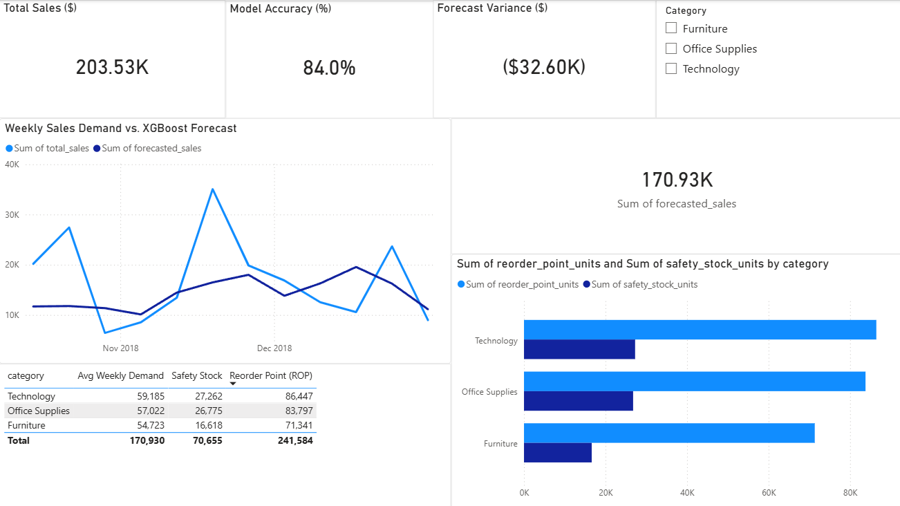
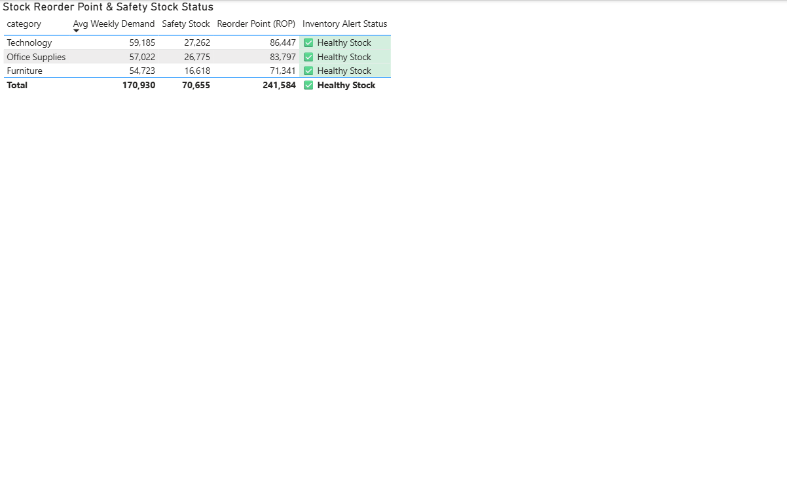

# 📈 Sales Forecasting & Inventory Optimization Dashboard

An end-to-end analytics and machine learning solution designed to predict product demand, calculate dynamic safety stock levels, and present executive-grade inventory insights using **Python (XGBoost)**, **SQLite**, **DAX**, and **Power BI**.

---

## 📌 Executive Summary

Modern retail supply chains struggle with balancing overstocking costs against revenue loss from stockouts. This project bridges predictive machine learning with dynamic reporting to optimize inventory levels across product categories:

* **Demand Prediction:** Built an XGBoost time-series model to forecast weekly demand patterns.
* **Inventory Safety Stock Logic:** Automated Safety Stock and Reorder Point ($ROP$) calculations based on forecasted demand and target service levels.
* **Executive Dashboards:** Interactive Power BI report featuring DAX variance analysis, report-page tooltips, conditional inventory alert highlighting, and category-level slicing.

---

## 📊 Power BI Executive Dashboard





---

## 🛠️ Tech Stack & Architecture

| Layer | Technology | Key Usage |
| :--- | :--- | :--- |
| **Data Ingestion & Storage** | SQLite / SQL | Storing relational transaction history and executing aggregation queries |
| **Machine Learning** | Python (XGBoost, Pandas, Scikit-Learn) | Time-series feature engineering and multi-step sales forecasting |
| **Data Modeling & DAX** | Power BI | Dedicated `_Measures` table, custom tooltips, dynamic metrics |
| **Version Control** | Git / GitHub | Code management and asset documentation |

---

## ⚙️ Project Pipeline

```text
[ Raw Sales CSV ]
        │
        ▼
[ SQLite Database ] ──( SQL Queries )──► [ Aggregated Weekly Data ]
                                                     │
                                                     ▼
                                         [ XGBoost Forecast Model ]
                                                     │
                                                     ▼
                                         [ Safety Stock & ROP Logic ]
                                                     │
                                                     ▼
                                         [ Power BI Executive Dashboard ]